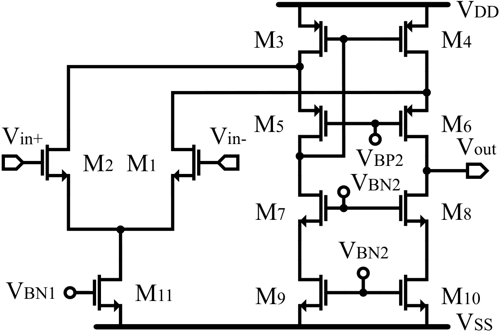
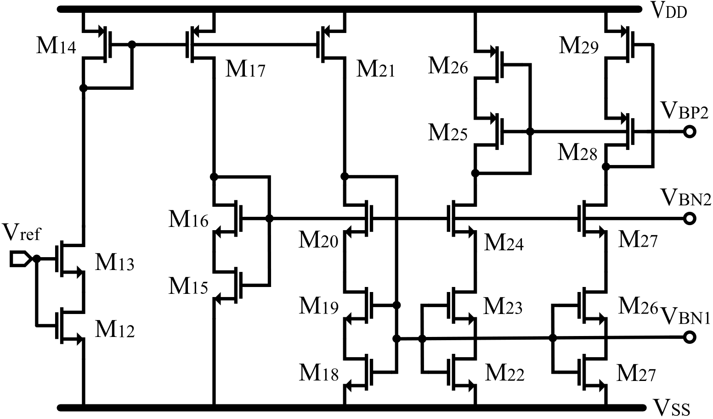

# Schematic Design

In this folder you will find all files related to schematic design and verification. Here we have implemented Xschem as user interface tool to run ngspice and design typical case, then using CACE to run PVT and MC simulations.

## Table of Contents

1.  [File structure](#1-File-structure)
2.  [Design objectives](#2-Design-objectives)
3.  [Design Specifications](#3-specifications-of-the-designed-folded-cascode)

---

## 1. File Structure

Each design folder contains the verification setup for a specific circuit. Inside, you can run:

- Conventional testbenches
- PVT (Process, Voltage, Temperature) verification
- Monte Carlo analysis

Currently, the full verification flow is only available in the `error_amplifier_v*version*` directories.

### 1.1. File Organization

The design files follow the naming convention:

```bash
error_amplifier_N_input_*device*_v*version*
```

*device* could be:

- **core** → contains only the amplifier core  
- **bias** → contains only the biasing network for that version  
- *(empty)* → represents the complete top-level amplifier (core + bias)  

This structure makes it easy to test and compare individual building blocks as well as the full design.

### 1.2. Open the Xchem testbench

To open the schematics with **xschem** inside the Docker container, navigate to the following directory:

```bash
Glayout-Based-Folded-Cascode/designs
```

From there, you can run:

- To open a specific file directly:

  ```bash
  xschem path/to/file.sch &
  ```

- To open xschem first and then load the desired file from its interface:

  ```bash
  xschem &
  ```

**Note:** xschem uses the directory from which it was launched as the reference path for opening files.
For consistency, the convention is to always launch xschem from the designs directory.

All design files should be opened this way, except for the CACE templates, which follow their own path conventions.

### 1.3. Open the CACE Templates

### 2.1. Opening CACE Simulation Files

To open the CACE simulation templates, xschem must be executed from within the corresponding project directory:

```bash
Glayout-Based-Folded-Cascode/designs/error_amplifier_v*version*/
```

Once inside the directory, run:

```bash
xschem cace/templates/file_to_open.sch &
```

### 1.4. Run PVT and Montecarlo with CACE

CACE is used to run corner analysis as well as Monte Carlo simulations. Note that Monte Carlo can also be executed directly from the conventional testbenches.

Each CACE setup is defined by a YAML file located at:

```bash
designs/error_amplifier_v*version*/cace/error_amplifier_v*version*.yaml
```

This YAML file describes which simulations will be executed. 
To run the simulations as with the CACE templates, you must first navigate to the project directory from there, run one of the following commands:

- Schematic-level verification only:  

  ```bash
  cace -s schematic
  ```

- Post-layout-level verification:  

  ```bash
  cace
  ```

## 2. Design objectives

As mentioned in home, four designs were implemented to evaluate the proposed flow, all based on an OTA folded cascode topology with an N-type differential input and a single-ended output. The core amplifier circuit is shown here:



while the biasing circuit is presented as:



The concept behind this 4 versions is that the same circuit can be designed for different applications, requesting high gain and low offset, or requesting wide-band signal amplification. However, the layout structure may not change, even if devices dimentions change, placement and signal work may stay the same.


The table below summarizes the key performance metrics obtained from pre and post-layout simulations for V1 design.


<table align="center">
  <thead>
    <tr>
      <th rowspan="2" align="center">Symbol</th>
      <th rowspan="2" align="center">Units</th>
      <th colspan="3" align="center">Spec</th>
      <th colspan="3" align="center">Schematic</th>
      <th colspan="3" align="center">Post-Layout</th>
    </tr>
    <tr>
      <th align="center">Min</th>
      <th align="center">Typ</th>
      <th align="center">Max</th>
      <th align="center">Min</th>
      <th align="center">Typ</th>
      <th align="center">Max</th>
      <th align="center">Min</th>
      <th align="center">Typ</th>
      <th align="center">Max</th>
    </tr>
  </thead>
  <tbody>
    <tr>
      <td align="center">Temp</td>
      <td align="center">[°C]</td>
      <td align="center">-40</td>
      <td align="center">25</td>
      <td align="center">125</td>
      <td align="center">-40</td>
      <td align="center">25</td>
      <td align="center">125</td>
      <td align="center">-40</td>
      <td align="center">25</td>
      <td align="center">125</td>
    </tr>
    <tr>
      <td align="center">VDD</td>
      <td align="center">[V]</td>
      <td align="center">2.97</td>
      <td align="center">3.3</td>
      <td align="center">3.63</td>
      <td align="center">2.97</td>
      <td align="center">3.3</td>
      <td align="center">3.63</td>
      <td align="center">2.97</td>
      <td align="center">3.3</td>
      <td align="center">3.63</td>
    </tr>
    <tr>
      <td align="center">UGBW</td>
      <td align="center">[MHz]</td>
      <td align="center">10</td>
      <td align="center">--</td>
      <td align="center">--</td>
      <td align="center">11.1</td>
      <td align="center">26</td>
      <td align="center">53.9</td>
      <td align="center">10.1</td>
      <td align="center">20.8</td>
      <td align="center">47</td>
    </tr>
    <tr>
      <td align="center">Av</td>
      <td align="center">[dB]</td>
      <td align="center">70</td>
      <td align="center">--</td>
      <td align="center">--</td>
      <td align="center">75.9</td>
      <td align="center">81</td>
      <td align="center">82.8</td>
      <td align="center">75.8</td>
      <td align="center">80.6</td>
      <td align="center">82.7</td>
    </tr>
    <tr>
      <td align="center">PM</td>
      <td align="center">[°]</td>
      <td align="center">50</td>
      <td align="center">--</td>
      <td align="center">--</td>
      <td align="center">72.1</td>
      <td align="center">73</td>
      <td align="center">75.7</td>
      <td align="center">57.8</td>
      <td align="center">60.2</td>
      <td align="center">63.9</td>
    </tr>
    <tr>
      <td align="center">Voff(3Sig)</td>
      <td align="center">[mV]</td>
      <td align="center">--</td>
      <td align="center">--</td>
      <td align="center">10</td>
      <td align="center">--</td>
      <td align="center">--</td>
      <td align="center">14.1</td>
      <td align="center">--</td>
      <td align="center">--</td>
      <td align="center">3.5</td>
    </tr>
    <tr>
      <td align="center">CL</td>
      <td align="center">[pF]</td>
      <td align="center">--</td>
      <td align="center">5</td>
      <td align="center">--</td>
      <td align="center">--</td>
      <td align="center">5</td>
      <td align="center">--</td>
      <td align="center">--</td>
      <td align="center">5</td>
      <td align="center">--</td>
    </tr> 
  </tbody>
</table>